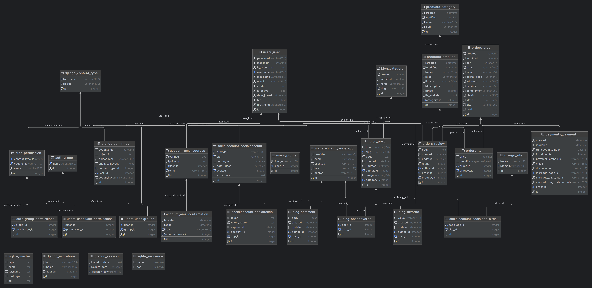

# Projeto de Educação e Comércio

Este projeto foi desenvolvido com o objetivo de unir conhecimento e trabalhos desenvolvidos tanto em sala de aula como fora dela. Ele é implementado em Python, utilizando o framework Django para desenvolvimento web e integra o serviço de pagamento Mercado Pago. Este repositório contém um sistema administrativo, um blog e uma loja virtual.

## Visão Geral

### Objetivo

O objetivo deste projeto é aplicar conhecimentos de segurança da informação, desenvolvimento de sistemas ministrado pelo Prof. Thiago Piperno Bonetti, sistemas web pelo Prof. Jaime Dias, e o uso de frameworks e bancos de dados conforme instruções do Prof. Rufino.
### Tecnologias Utilizadas

- **Python**: Linguagem de programação principal.
- **Django**: Framework web utilizado para o desenvolvimento do aplicativo.
- **Mercado Pago**: Serviço de pagamento integrado para processar transações financeiras.
- **Banco de Dados SQLite**: Para armazenar informações relevantes.
- 
### Ferramentas Utilizadas

- **Visual Studio code**: IDEA
- **DataGrip**: IDEA para banco de dados
- **PhotoShop**: Criação de logos
  
## Diagrama de Entidade-Relacionamento (DER)

Abaixo está o diagrama de entidade-relacionamento (DER) do banco de dados utilizado neste projeto:

## Funcionalidades

### Sistema Administrativo

O sistema administrativo é a parte central do projeto e oferece as seguintes funcionalidades:

- Gerenciamento de conteúdo do blog, incluindo a criação, edição e exclusão de materiais didáticos.
- Controle de usuários, com diferentes níveis de permissões.
- Controle do e-commerce 

### Blog

O projeto inclui um blog que permite:

- Publicação de artigos e posts.
- Comentários e interação dos usuários.

### Loja Virtual

A loja virtual oferece:

- Listagem de produtos para venda.
- Processamento de pagamentos através do Mercado Pago.
- Controle de estoque e pedidos.

